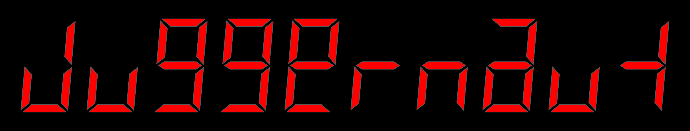
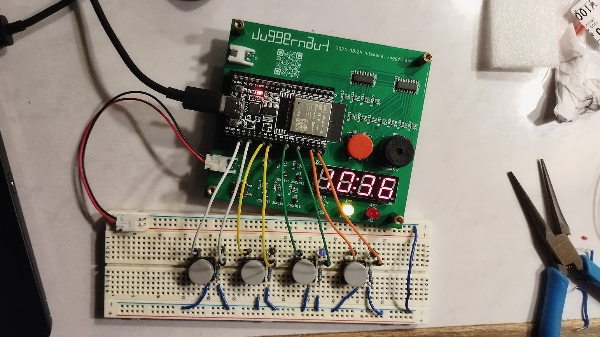

# Juggernaut

Juggernautは与えられた回路図とプログラムを読み解き，規定内の操作を行うことで時限爆弾型の「装置」を停止させる（解除する）競技です．
解除すべき「装置」とその回路図，書き込まれているプログラムが渡され，その内容を読み解きながらワイヤを切ったりボタンを押したり傾けたりして時間内に「装置」を停止させることを目指します．

作問者には回路構成力とプログラムを柔軟に書く力が，解除する側には回路図やデータシートを読む力とプログラムを素早く間違いなく解読する力が求められ，教育面での効果が期待できます．  
解除するまでの時間を競う競技型や，お互いに装置を作って解除しあってワイワイするイベント型を想定しています．

## お知らせ（2023 12/13 追記）

SECCONのイベントである電脳会議で，Juggernaut初となるオフラインの企画を2023年12月23日(土)に開催します！
詳しくは[こちら](https://www.seccon.jp/2023/ep231223.html)をチェック！

## 競技規則

[regulation.md](https://github.com/Alignof/Juggernaut/blob/master/regulation.md)を参照．

## 関連リポジトリ

運営などに便利なツールを用意しました．

### [Juggernaut_spec_builder](https://github.com/Alignof/Juggernaut_spec_builder)

運営に提出する仕様書（giverからsolverに渡される問題文兼取説）のpdfをmarkdownから簡単に作れるツールです．
docker imageに突っ込まれたpandocであれこれ変換してます．

## Author

2020 10.31  
Takana Norimasa  
homepage: [https://alignof.github.io/](https://alignof.github.io/)  
github : [https://github.com/Alignof/](https://github.com/Alignof/)  
Twitter : [https://twitter.com/\_Alignof](https://twitter.com/_Alignof)
